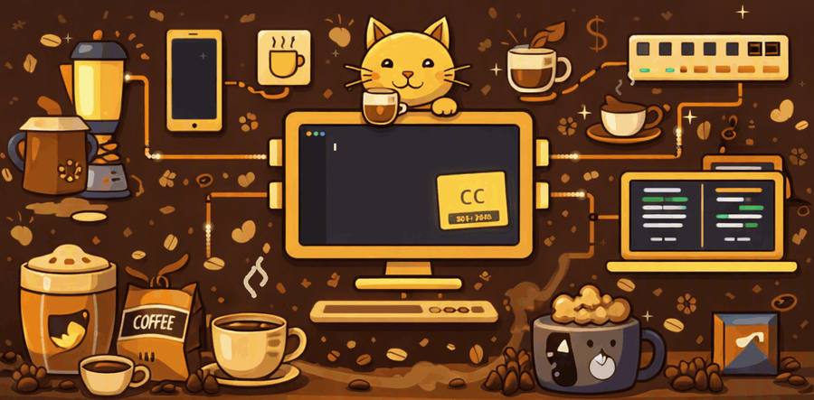

<!--
  THE DRAFTING ROOM — README for chris-crts/My-Website-Portfolio
  Theme: architectural drafting desk · blueprint ink on paper · red-pencil accent
  Palette (edit these hex codes to match the exact CSS variables in style.css):
    Paper  F4EFE3   Ink  1B2A41   Blueprint  1F4E8C   Red pencil  C0392B
    Dark BG 0E1A2B  Dark text CFE3FF
-->

<div align="center">

<picture>
  <source media="(prefers-color-scheme: dark)" srcset="https://capsule-render.vercel.app/api?type=rect&color=0E1A2B&height=190&section=header&text=THE%20DRAFTING%20ROOM&fontSize=44&fontColor=CFE3FF&fontAlignY=42&desc=Christopher%20Cortes%20%C2%B7%20Portfolio%20Archive%20MMXXVI&descSize=16&descAlignY=66">
  <source media="(prefers-color-scheme: light)" srcset="https://capsule-render.vercel.app/api?type=rect&color=F4EFE3&height=190&section=header&text=THE%20DRAFTING%20ROOM&fontSize=44&fontColor=1B2A41&fontAlignY=42&desc=Christopher%20Cortes%20%C2%B7%20Portfolio%20Archive%20MMXXVI&descSize=16&descAlignY=66">
  
</picture>


<br/>

[](https://chris-crts-page.netlify.app/)


**[§ III Dossier](#-iii--professional-dossier) · [§ I Workshop](#-i--workshop--toolbox) · [§ II Blueprint Archive](#%EF%B8%8F-ii--blueprint-archive) · [Structure](#%EF%B8%8F-repository-structure) · [Correspondence](#%EF%B8%8F-correspondence)**

</div>

---

## 📐 About This Archive

> **ARCHIVE REF: CC-2026 · VOL. III**

A showcase of my work as a **BS Computer Science graduate** and **freelance web developer**. This portfolio demonstrates my ability to build responsive, maintainable, and secure web applications using modern technologies — presented as an architect's drafting room, with a **Workshop** for tools, a **Blueprint Archive** for case files, and a **Professional Dossier** for the CV.

<div align="center">

**➡️ [Visit the live portfolio](https://chris-crts-page.netlify.app/)** · **📄 [Download my CV (PDF)](https://chris-crts-page.netlify.app/media/file/Professional_CV.pdf)**

<!-- 📸 Paste your existing Light & Dark Mode screenshots here (drag the images into the GitHub editor). -->

</div>

**What the site does**

- 🌗 **Light & dark themes** with a one-tap theme switcher
- 📱 **Two layouts** — a full drafting-room layout on desktop and an app-style layout on mobile (top bar + bottom navigation)
- 🗂️ **Case-file carousels** with swipe/arrow navigation for projects and toolbox drawers
- 🔗 **View routing** with URL hashes and a custom `404` page
- ⚡ **Plain HTML, CSS and JavaScript** — no framework, no build step

---

## 🧾 § III — Professional Dossier

<table>
<tr>
<td width="200" align="center">
<br/>
<sub>I 💓 One Piece</sub>
</td>
<td>

### Christopher Cortes
*“Engineer of scalable apps, breaker of bugs, and occasional coffee alchemist.”*

| | |
| --- | --- |
| ⌾ **Role** | Junior Software Developer @ UpUp-App Technologies |
| ⌖ **Location** | Masbate City, Philippines |
| ✉ **Email** | [11corteschristopher@gmail.com](mailto:11corteschristopher@gmail.com) |
| ⌘ **Availability** | Open to freelance, collaborations & custom builds |

</td>
</tr>
</table>

<div align="center">

| **10+** | **2+** | **10+** | **1.50** |
| :---: | :---: | :---: | :---: |
| Projects | Yrs Freelance | Technologies | GWA |

</div>

> I build scalable web & mobile applications, blending healthcare, civic, and AI-powered systems — turning complex problems into elegant, working solutions.

#### ◆ Education

**B.S. Computer Science** · Osmeña Colleges, Masbate City, Philippines
🎓 Batch 2026 · **Cum Laude** · GWA 1.50

#### ⌘ Skills & Interests

*Tools, languages & focus areas*


**Off the clock**


#### ◉ Career Interests

| 💻 Software Development | 🛡️ Cybersecurity | 🤖 Artificial Intelligence |
| :---: | :---: | :---: |

---

## 🧰 § I — Workshop & Toolbox

*The tools, languages, and frameworks that stock the workshop drawers.*

| Drawer | Category | Instruments |
| :---: | --- | --- |
| **01** | **Frontend Instruments** | React & React Native · HTML · CSS · Tailwind CSS · Bootstrap · JavaScript |
| **02** | **Backend Instruments** | Django · PostgreSQL · RESTful API |
| **03** | **Networking Fundamentals** *(learning)* | Cisco Packet Tracer · VLAN Configuration · Basic Routing · Basic Switching · Network Simulation |
| **04** | **Cybersecurity Tools** | Wireshark · Metasploit · Burp Suite · GoBuster / Nikto / SQLMap · Hydra / John / Hashcat · Nmap / Nessus · Radare2 / Ghidra |
| **05** | **Design & Auxiliary Tools** | Git & GitHub · Canva · Photoshop · AutoCAD · MS Office · Blender |

<div align="center">

**🔧 PRINCIPAL INSTRUMENT**


*The primary language of the workshop — used across all backend systems, automation, and AI integrations.*

</div>

---

## 🗂️ § II — Blueprint Archive

*Engineering-style documentation for selected builds — one project per file.*

### 🆕 Featured Case File — TraceForge


**Security Investigation Platform** · `COMPLETED` · 🔒 *private repository*
*Discover the surface · Trace the path · Prove the weakness.*

| | |
| --- | --- |
| **Objective** | A single workspace for security testers to recon, investigate, and prove vulnerabilities — end to end. |
| **Solution** | An evidence-first workflow: investigate targets, run controlled AI agent missions, and generate a traceable report from discovery to findings. |
| **Controlled execution** | Every action is scoped, limited, logged, and requires human sign-off — no unrestricted autonomy. |
| **Core capabilities** | AI Security Chat · Agent Missions · Human Approval Gates · Attack-Surface Discovery · Evidence Collection · Audit Trail & Reporting · Bring Your Own Key |

```text
Recon  →  Discover  →  Investigate  →  Verify  →  Report
```


### 📁 All Case Files

| # | Case File | Category | Objective | Stack | Status | Link |
| :---: | --- | --- | --- | --- | :---: | --- |
| **01** | **Netwatch SOC System** | Security | LAN-based SOC that enumerates devices and detects Nmap scans, port probing and suspicious downloads | Python / Django · IDS/IPS · Port Mirroring | ✅ Completed | [Repo](https://github.com/chris-crts/Netwatch-SOC) |
| **02** | **AI-Powered Clinical Management System** | HealthTech · AI | Appointments, EHR and medicine inventory with BioBERT semantic search and a BioGPT RAG chatbot | Django · PostgreSQL · BioBERT · BioGPT · RAG · RBAC | ✅ Completed | 🔒 Private |
| **03** | **E-Invoicing & Verification System** | 4th-Year Capstone | Create, share, negotiate and finalize non-VAT invoices with QR verification and tamper-evident records | Django · REST API · PostgreSQL · reportlab | 🟢 Live | [Try it](https://nontaxinvoiceproof.pythonanywhere.com/) |
| **04** | **BeaPro Beauty Studio** | Promotional | Editorial-style, luxury-inspired landing page concept | HTML / CSS / JS | 🟢 Live | [Demo](https://beaupro-studio-masbate.netlify.app/) |
| **05** | **Rolex Luxury Collection** | Promotional | Showcase of Submariner, Daytona and GMT-Master II | HTML / CSS / JS | 🟢 Live | [Demo](https://rolex-showcase.netlify.app/) |
| **06** | **School Documentary Webpage** | Web Dev | Academic programs, values and legacy of Osmeña Colleges — zero dependencies | HTML / CSS / JS | 🟢 Live | [Open](https://osmena-colleges.netlify.app/) |
| **07** | **School Class Voting System** | Civic Tech | Nominate → Campaign → Vote → Results with Student ID auth and an admin panel | HTML / CSS / JS · Hono.js · PostgreSQL | ✅ Completed | 🔒 Private |
| **08** | **Social Media Web Application** | Social Platform | Private messaging, customizable profiles, friends, reactions and comments | Django · PostgreSQL · HTML / CSS / JS | ✅ Completed | 🔒 Private |
| **09** | **AI Mobile Application** | Mobile · AI | Natural-language interface powered by OpenAI's API | React Native · Django · SQLite · OpenAI API | ✅ Completed | [Source](https://github.com/Wawayooo/Ai_Search) |
| **10** | **Learning Management System** | Desktop App | Desktop LMS with PDF delivery, full-text search and interactive quizzes (Kali Linux–themed) | Visual Basic · XAMPP MySQL | 🌐 Open source | [Demo](https://fb.watch/tfkpDjXMXF/) · [Source](https://github.com/Wawayooo/University-of-Kali-Linux-Certification-System) |
| **11** | **Marci Metzger Homes** | Client Work | Full-scroll realtor landing page with listing search, gallery and a working contact form | HTML / CSS / JS | ✅ Completed | [Live](https://junior-web-builder-ass.netlify.app/) |

---

## 🗃️ Repository Structure

```text
My-Website-Portfolio./
├── index.html     # Page markup — desktop & mobile layouts
├── style.css      # Drafting-room theme, light/dark tokens, responsive rules
├── logic.js       # View controller, theme switcher, carousels
├── 404.html       # Custom "not found" / private-repository page
└── README.md      # You are here
```

### Run it locally

```bash
git clone https://github.com/chris-crts/My-Website-Portfolio..git
cd My-Website-Portfolio.

# any static server works
python -m http.server 8000
# then open http://localhost:8000
```

### 🖊️ Drafting notes (open issues)

- [#1 — Improve theme toggle accessibility & state feedback](https://github.com/chris-crts/My-Website-Portfolio./issues/1)
- [#3 — Synchronize application view state with responsive UI chrome](https://github.com/chris-crts/My-Website-Portfolio./issues/3)

---

## ✉️ Correspondence

| | Channel | Details |
| :---: | --- | --- |
| **01** | Email | [11corteschristopher@gmail.com](mailto:11corteschristopher@gmail.com) |
| **02** | LinkedIn | [christopher-cortes-a0021a28b](https://www.linkedin.com/in/christopher-cortes-a0021a28b/) |
| **03** | GitHub | [github.com/chris-crts](https://github.com/chris-crts) |
| **04** | Telephone | Available upon request |

<div align="center">

<sub>© 2026 Christopher Cortes. All rights reserved. · Open to freelance, collaborations, and custom builds.</sub>

<picture>
  <source media="(prefers-color-scheme: dark)" srcset="https://capsule-render.vercel.app/api?type=rect&color=0E1A2B&height=70&section=footer&text=ARCHIVE%20REF%20%C2%B7%20CC-2026&fontSize=16&fontColor=CFE3FF&fontAlignY=50">
  <source media="(prefers-color-scheme: light)" srcset="https://capsule-render.vercel.app/api?type=rect&color=F4EFE3&height=70&section=footer&text=ARCHIVE%20REF%20%C2%B7%20CC-2026&fontSize=16&fontColor=1B2A41&fontAlignY=50">
  
</picture>

</div>


<!-- Animated cat-tech + coffee banner -->

